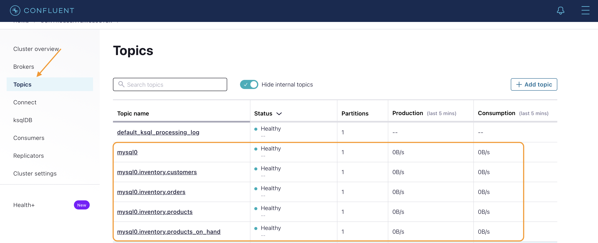
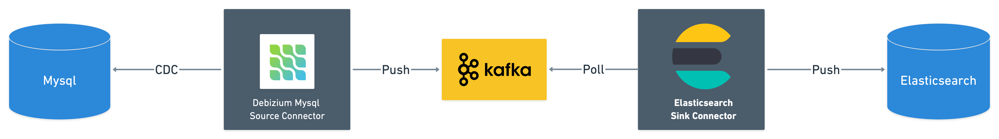
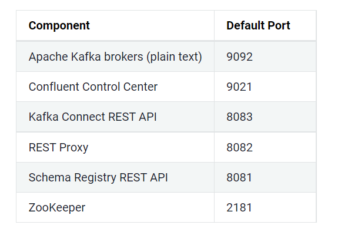
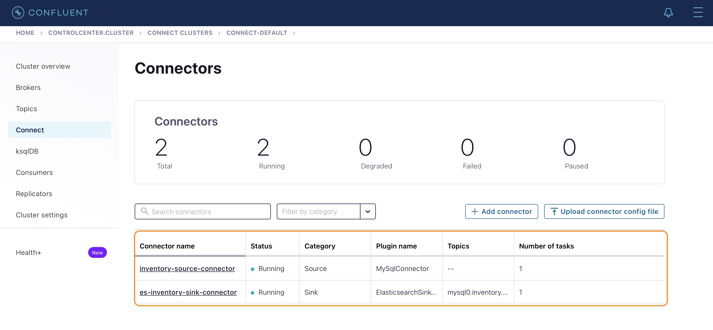
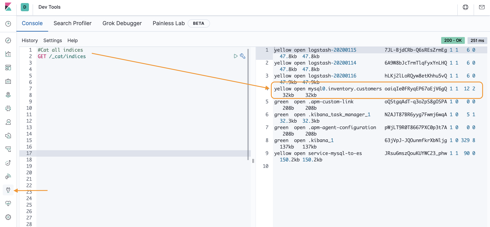
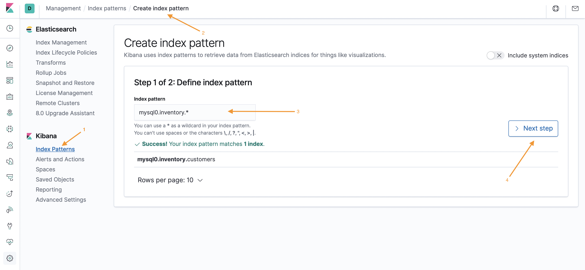
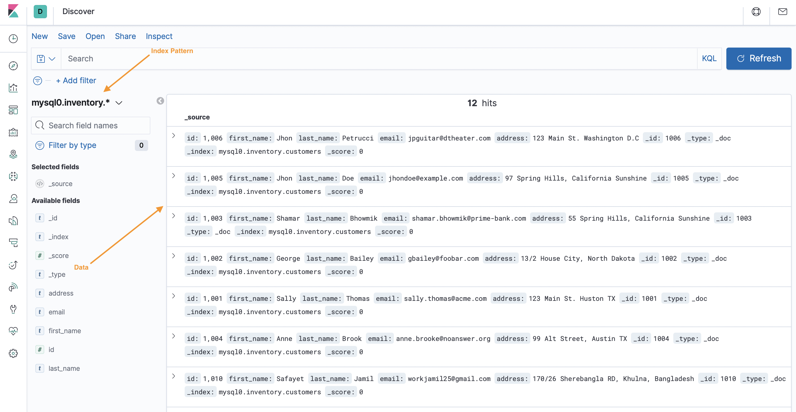

# Mysql Data Migration to Elasticsearch
In this documentation, we will see

1. [Problem Statement](#problem-statement)
2. [Kafka Connect](#kafka-connect)
4. [Kafka Connectors](#kafka-connectors)
5. [Connector Cencepts](connector-concepts)
6. [Streaming Changes from Mysql to Elasticsearch](#streaming-changes-from-mysql-to-elasticsearch) 
7. [Mysql Configuration](#mysql-configuration)
8. [Register Debizium Mysql Source Connctor](#register-debizium-mysql-source-connctor)
9. [Elasticsearch & Kibana Configuration](#elasticsearch--kibana-configuration)
10. [Register Elasticsearch Sink Connector](#register-elasticsearch-sink-connector)
11. [View Elasticsearch data from Kibana](#view-elasticsearch-data-from-kibana)
12. [Fulltext Search on Customer data using Kibana](#fulltext-search-on-customer-data-using-kibana)
13. [Implement Global Search Service in Springboot](#implement-global-search-service-in-springboot)
14. [Tryout Global Search Service REST APIs](#tryout-global-search-service-rest-apis)


## Problem Statement
Fast searching capability, Realtime data ingestion are very cross-cutting needs for modern applications. Suppose we are building a *Real-Estate Business* service where Sellers can Register  themselves and Buyers can search by `Seller Name`, `Email`, `Address` etc and `Mysql` is our primary Datasource.

We were going well with our good old Mysql Database untill our Service got public attention and our Mysql DB is getting populated with large amount of data. Because as the data is growing our Search is getting slower. To solve this issue we came up with `Elasticsearch` and agreed to use it as a search engine for our `Global Search Feature`. 

But at the same time we can not abandone `Mysql` DB because our *customer registration*, *property listing* are still using it as the main Database. So, All we can do is **`Replicate`** these data from **`Mysql to Elasticseach`** database.

*But how can we ingest data from MySql to Elasticsearch in Relatime?*
> To do that, we are going to use Kafka but as a Software Engineer we want to build the pipeline as reliable as possible because we don't want to spend much time on code-base maintanence. Here the **`Kafka Connector`** comes into the picture.

## Kafka Connect

Kafka Connect is the pluggable, declarative `data integration framework` for Kafka. There are hundreds [Kafka Connector Plugins](https://www.confluent.io/hub/?_ga=2.78459357.837371935.1649245798-1948065767.1649245798) available in Confluent Hub, can be installed easily It's an open source Apache Kafka component that helps to move the data `IN` or `OUT` of Kafka easily. It provides a scalable, reliable, and simpler way to move the data from a `source` datastore to `destination` datastore.

## Kafka Connectors
Kafka Connect uses connector plugins that are community developed libraries to provide most common data movement cases. According to the data direction, there are two types of Kafka connectors exists. Kafka plugins provides the standardised implementation for data migration between different datasources.

1. **`Source Connector:`** Reads data from a datasource and writes to Kafka topic. It's `Mysql` in our case.


2. **`Sink Connector:`** Reads data from Kafka topic and writes to a datasource. It's `Elasticsearch` in our case.


## Connector Cencepts
Connector plugins implement the connector API that includes `connectors` and `tasks`.

`Connector:` is a job that manages and coordinates the tasks. It decides how to split the data-copying work between the tasks.

`Task:` is piece of work that provides service to accomplish actual job.

Connectors divide the actual job into smaller pieces as tasks in order to have the ability to scalability and fault tolerance. The state of the tasks is stored in special `Kafka Topics`, and it is configured with `offset.storage.topic`, `config.storage.topic` and `status.storage.topic`. As the task does not keep its state it can be started, stopped and restarted at any time or nodes.

In our case, Debezium Mysql Source Connector is used to copy data from databases and it creates task per each table in the database such as. Let's checkout from `Confluent Control Center`.


`Worker:` is the node that is running the connector and its tasks. Kafka Connect workers executes 2 types of working modes:

`Standalone mode:` All work is performed in a single worker as single process. It is easier to setup and configure and can be useful where using single worker makes sense. However it does not provide fault tolerance or scalability.

`Distributed mode:` Multiple workers are in a cluster. Configured by REST API. Provides scalability and fault tolerance. When one connector dies, its tasks are redistributed by rebalance mechanism among other workers.

## Streaming Changes from Mysql to Elasticsearch 
Since the Customer Registration Data is inserting into Mysql, we need to stream the Captured Data Change (CDC) to a Kafka topic. We are using [Debezium Mysql CDC Source Connector](https://www.confluent.io/hub/debezium/debezium-connector-mysql) for reading the `bin.log` changes and sending to Kafka topics and on the other side the [Elasticsearch Sink Connector](https://www.confluent.io/hub/confluentinc/kafka-connect-elasticsearch) is polling from that particular Topic continuously and pushing the data to Elasticsearch in realtime (`< 10ms latency`)



I'm assuming that yo already have a [Confluent Kafka Platform](https://docs.confluent.io/platform/current/quickstart/ce-docker-quickstart.html) up and running and both of the [Debezium Mysql CDC Source Connector](https://www.confluent.io/hub/debezium/debezium-connector-mysql) and [Elasticsearch Sink Connector](https://www.confluent.io/hub/confluentinc/kafka-connect-elasticsearch) plugins are installed.

Here is a default port maps for Confluent Platform Services


First of all, Let's verify that our Kafka Connect Rest Api is up and running.

Endpoint: `http://CONNECT_URL:8083/` <br>
Method: `GET` <br>
Response:

```json
{
	"version": "7.0.1-ce",
	"commit": "7a482a683a659902",
	"kafka_cluster_id": "5h1gLwdrR4qvUcDZ9yBOTQ"
}
```

## Mysql Configuration
Cool, Now we need mysql [`docker-compose.yml`](https://github.com/dipanjal/kafka-learning/blob/kafka-connect/docker-compose/mysql/docker-compose.yml), all we need to modify the `mysql.cnf` as per your need.

```config
# ----------------------------------------------
# Enable the binlog for replication & CDC
# ----------------------------------------------

# Enable binary replication log and set the prefix, expiration, and log format.
# The prefix is arbitrary, expiration can be short for integration tests but would
# be longer on a production system. Row-level info is required for ingest to work.
# Server ID is required, but this will vary on production systems

server-id         = 223344
log_bin           = mysql-bin # enable this so that debizium can do CDC for bin.log files
expire_logs_days  = 1
binlog_format     = row
binlog_row_image  = full
expire_logs_days  = 10

gtid_mode                 = on
enforce_gtid_consistency  = on
```
>`server-id` is the unique identification number for mysql server. It's the most important thing here, using this server-id, debizium mysql connector will indentify our Mysql DB server. 
However, You will find necessary [`files here`](https://github.com/dipanjal/kafka-learning/tree/kafka-connect/docker-compose/mysql)


### Register Debizium Mysql Source Connctor
Endpoint: `http://CONNECT_URL:8083/connectors` <br/>
Method: `POST` <br/>
Headers: <br/>
```Accept: application/json```
```Content-Type: application/json```
Request:

```json
{
  "name": "mysql-inventory-source-connector",
  "config": {
    "connector.class": "io.debezium.connector.mysql.MySqlConnector",
    "tasks.max": "1",
    "database.hostname": "YOUR_DATABASE_HOST_OR_IP",
    "database.port": "3306",
    "database.user": "MYSQL_USERNAME",
    "database.password": "MNYSQL_PASSWORD",
    "database.server.id": "223344",
    "database.server.name": "mysql0",
    "database.whitelist": "inventory",
    "database.history.kafka.bootstrap.servers": "KAFKA_HOST:9092",
    "database.history.kafka.topic": "schema-changes.inventory"
  }
}
```

### Check Registered Connectors
Endpoint: `http://CONNECT_URL:8083/connectors` <br/>
Method: `GET` <br/>
Header: `Accept: application/json` <br/>
Request:

```json
[
	"mysql-inventory-source-connector"
]
```
## Elasticsearch & Kibana Configuration
Now it's time to configure Elasticsearch and Kibana (for visalizing elasticsearch data) using [`docker-compose.yml`](https://github.com/dipanjal/kafka-learning/blob/kafka-connect/docker-compose/elasticsearch/docker-compose.yml). 
If everything is ok our services will run on these ports bellow.

Services  | Port
------------- | -------------
Elasticsearch  | 9200
Kibana  | 5601

What's Next ? 
> Now, We need to Register connector configurations using [Kafka Connect Rest Api endpoints](https://docs.confluent.io/platform/current/connect/references/restapi.html)

### Register Elasticsearch Sink Connector
Endpoint: `http://CONNECT_URL:8083/` <br/>
Method: `POST` <br/>
Headers: <br/>
```Accept: application/json```
```Content-Type: application/json```

Request:

```json
{
  "name": "es-inventory-sink-connector",
  "config": {
    "connector.class": "io.confluent.connect.elasticsearch.ElasticsearchSinkConnector",
    "tasks.max": "1",
    "topics": "mysql0.inventory.customers",
    "connection.url": "http://ELASTICSEARCH_HOST:9200",
    "transforms": "unwrap,key",
    "transforms.unwrap.type": "io.debezium.transforms.ExtractNewRecordState",
    "transforms.key.type": "org.apache.kafka.connect.transforms.ExtractField$Key",
    "transforms.key.field": "id",
    "key.ignore": "false",
    "type.name": "customer"
  }
}
```

Let's check connectors from Confluent Control Center



## View Elasticsearch data from Kibana
Finally, all our configuration is done, let's check the migrated data in Elasticsearch using Kibana.

1. Check Elasticsearch Indices:

> Looks like we have found our desired index `mysql0.inventory.customers`

2. Create Index Pattern:


3. View in Discovery:


## Fulltext Search on Customer data using Kibana
Congratulation!! we have successfully migrated Mysql data to Elasticsearch, even if we any change (executing some DDL/DML operations) on Mysql, will be migrated to Elasticsearch. Cool, Right ? Now let's playaround with some Elasticsearch Queries for our desired `Full-text Search`

* View all data from Index:

```
GET mysql0.inventory.customers/_search
{
  "query": {
    "match_all": {}
  }
}
```

* Full Document Search:

```
GET mysql0.inventory.customers/_search
{
  "query": {
    "bool": {
      "should": [
        { "match_phrase_prefix": {"first_name": "monstar"} },
        { "match_phrase_prefix": {"last_name": "monstar"} },
        { "match_phrase_prefix": {"email": "monstar"} },
        { "match_phrase_prefix": {"address": "monstar"} }
      ]
    }
  }
}
```
> It will return all the results has matching prefix. Basically, we will be using this query in our Springboot backend service.

## Implement Global Search Service in Springboot
We are opt to build a Rest API Service for our Global Search feature.
1. Add Dependency in `pom.xml`:

```xml
<dependency>
        <groupId>org.springframework.boot</groupId>
        <artifactId>spring-boot-starter-data-elasticsearch</artifactId>
</dependency>
```
2. Configure High Level Rest Client: `ElasticSearchConfig.java`

```java
@Configuration
public class ElasticSearchConfig extends AbstractElasticsearchConfiguration {

    @Value("${spring.elasticsearch.uris}")
    private String elasticsearchUri;

    public final static String INDEX = "mysql0.inventory.customers";
    
    @Override
    @Bean
    public RestHighLevelClient elasticsearchClient() {
        final ClientConfiguration configuration = ClientConfiguration.builder()
                .connectedTo(elasticsearchUri)
                .build();
        return RestClients.create(configuration).rest();
    }
}

```

3. Create a Search Controller: `SearchController.java`

```java
@RestController
@RequiredArgsConstructor
public class SearchController {

    private final SearchService searchService;

    @GetMapping("/search/customer/{phrase}")
    public ResponseEntity<List<Customer>> searchCustomerByPhrase(@PathVariable final String phrase) throws IOException {
        return ResponseEntity.ok(searchService.customerGlobalSearch(phrase));
    }
}
```

4. Create Elasticsearch Customer Search Service: `ESCustomerService.java`

```java
@Slf4j
@Service
@RequiredArgsConstructor
public class ESCustomerService {

    private final RestHighLevelClient client;

    public List<Customer> customerGlobalSearch(String phrase) throws IOException {
        QueryBuilder queryBuilder1 = this.buildDynamicQuery(
                phrase,
                List.of("first_name", "last_name", "email", "address")
        );

        SearchRequest request = new SearchRequest(ElasticSearchConfig.INDEX)
                        .source(new SearchSourceBuilder().query(queryBuilder1));

        SearchResponse response = client.search(request, RequestOptions.DEFAULT);

        return SearchResponseMapper.mapSearchResponse(response, Customer.class);
    }

    private QueryBuilder buildDynamicQuery(String phrase, List<String> fields) {
        log.info("Building dynamic query");
        BoolQueryBuilder queryBuilder = QueryBuilders.boolQuery();
        for(String field : fields) {
            queryBuilder.should(QueryBuilders.matchPhrasePrefixQuery(field, phrase));
            log.info("{} : {}", field, phrase);
        }
        return queryBuilder;
    }
}
```

You can explore the full code-base in the Repository [`kafka-poc`](https://github.com/dipanjal/kafka-learning/tree/kafka-connect/kafka-poc)

## Tryout Global Search Service REST APIs
Request: `http://localhost:8080/search/customer/monstar`
Method: `GET`

Response:

```json
[
  {
    "id": "1007",
    "firstName": "Sanim",
    "lastName": "Khan",
    "email": "sanimkhan@monstar-lab.com",
    "address": "Agargaon Residential Area, Dhaka, Bangladesh"
  },
  {
    "id": "1009",
    "firstName": "Dipanjal",
    "lastName": "Maitra",
    "email": "dipanjal.maitra@monstar-lab.com",
    "address": "Madhupur, Shreepur, Magura, Bangladesh"
  },
  {
    "id": "1008",
    "firstName": "Ashraful",
    "lastName": "Alam",
    "email": "ashraful.alam@monstar-lab.com",
    "address": "Khabash Pur, Faridpur Shadar, Bangladesh"
  }
]
```
Boom!!

## Reference
* [https://www.confluent.io/blog/kafka-connect-tutorial/](https://www.confluent.io/blog/kafka-connect-tutorial/)
* [https://turkogluc.com/apache-kafka-connect-introduction/](https://turkogluc.com/apache-kafka-connect-introduction/)
* [https://developer.confluent.io/learn-kafka/kafka-connect/how-connectors-work/?_ga=2.43259244.837371935.1649245798-1948065767.1649245798#connectors](https://developer.confluent.io/learn-kafka/kafka-connect/how-connectors-work/?_ga=2.43259244.837371935.1649245798-1948065767.1649245798#connectors)
* [https://docs.confluent.io/platform/current/connect/references/restapi.html](https://docs.confluent.io/platform/current/connect/references/restapi.html)
